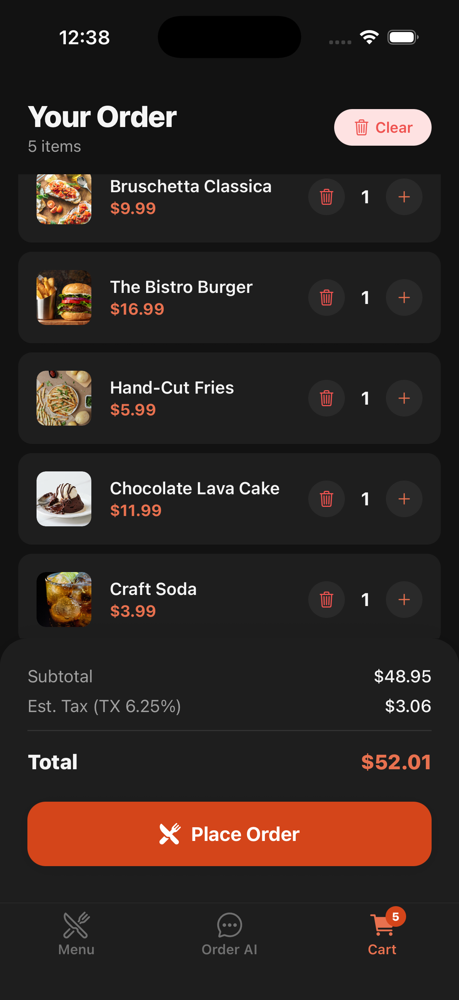
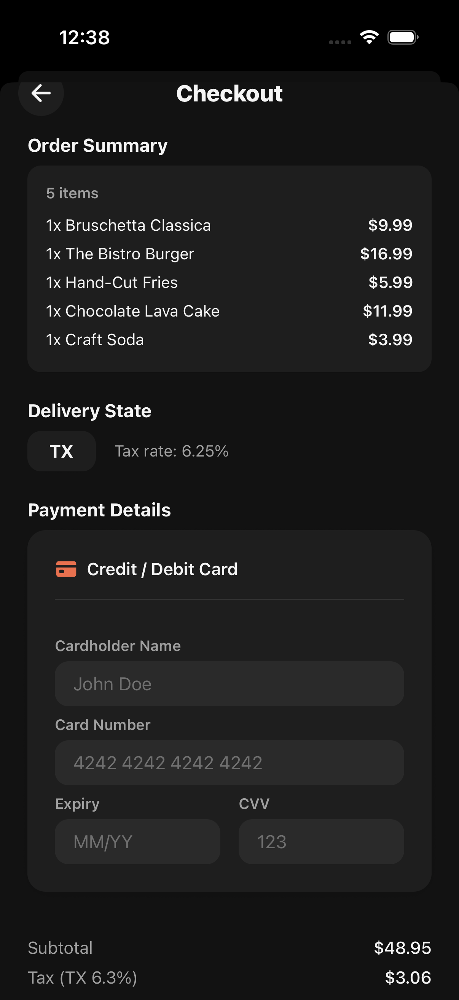

# 🍽️ The Intelligent Bistro

A high-fidelity mobile restaurant ordering experience powered by conversational AI. Users can browse a curated menu, manage their cart through natural language, and check out - all through a polished React Native interface backed by a Node.js API and Claude AI.

Built for the **Viridien AI Full-Stack Engineering Internship Challenge**.

---

## Screenshots

| Splash | Menu (Starters) | Menu (Mains) |
|:---:|:---:|:---:|
|  |  |  |

| Sides | Desserts | Drinks |
|:---:|:---:|:---:|
|  |  |  |

| Chat / Order AI | Cart | Checkout |
|:---:|:---:|:---:|
|  |  |  |

| Our Story |
|:---:|
|  |

---

## Features

### Core
- **Conversational Ordering** - Natural language cart management via Claude AI  
  _"Add two spicy chicken sandwiches and a large water"_ into structured cart updates
- **Dual Input** - Manage your cart through chat OR traditional UI tap interactions
- **Smart AI Assistant** - Contextual upsells, disambiguation, dietary awareness, combo suggestions
- **Real-time Cart** - Live totals, quantity adjustments, item removal

### Visual & UX
- **Splash/Onboarding Screen** - Animated timeline showing how the app works
- **Parallax Story Page** - Full-screen scrollable restaurant history with parallax images
- **Dark Mode** - Full light/dark theme toggle across all screens
- **Real Food Photography** - 22 unique high-quality menu item images
- **Animated Transitions** - Bounce effects, fade-ins, slide animations
- **Hero Banner** - Stylized restaurant header with overlay
- **Time-Aware Greeting** - "Good morning" / "Good afternoon" / "Good evening" based on time of day
- **Dietary Legend** - Visual key for Spicy, Vegetarian, Gluten-Free tags
- **Custom AI Avatar** - Stylized assistant image in chat bubbles

### Intelligence
- **Dynamic Soup du Jour** - Rotates daily (Tomato Bisque, Broccoli Cheddar, Clam Chowder), AI knows today's selection
- **State-Based Tax** - All 50 US states + DC tax rates at checkout
- **Combo Detection** - AI suggests combo deals when qualifying items are in cart
- **Conversation Memory** - Full chat history maintained for contextual follow-ups
- **Mock AI Fallback** - App works without API key using keyword-based responses

---

## Tech Stack

| Layer | Technology |
|-------|-----------|
| **Mobile** | React Native (Expo SDK 52), NativeWind v4, Zustand, React Navigation |
| **Backend** | Node.js, Express, Anthropic Claude API |
| **AI** | Claude Sonnet 4 for NLP intent parsing → structured JSON |
| **State** | Zustand (lightweight, zero-boilerplate) |
| **Styling** | NativeWind (Tailwind for RN), custom theme system with dark mode |

---

## Project Structure

```
intelligent-bistro/
├── backend/
│   ├── data/
│   │   └── menu.js              # Menu data, 25 items, combos, dynamic soup
│   ├── routes/
│   │   ├── menu.js              # GET /api/menu, search, popular, item detail
│   │   └── chat.js              # POST /api/chat - NLP processing
│   ├── services/
│   │   ├── ai.js                # Claude Sonnet integration + system prompt
│   │   └── mock-ai.js           # Keyword-based fallback (no API key needed)
│   ├── middleware/
│   │   └── errorHandler.js      # 404 + global error handling
│   ├── server.js                # Express entry point
│   ├── package.json
│   └── .env                     # ANTHROPIC_API_KEY (not committed)
├── mobile/
│   ├── assets/
│   │   └── images/menu/         # 22 food photos + bistro hero + assistant avatar
│   ├── src/
│   │   ├── screens/
│   │   │   ├── SplashScreen.js  # Animated onboarding with timeline
│   │   │   ├── MenuScreen.js    # Hero banner, categories, search, dietary legend
│   │   │   ├── ChatScreen.js    # Conversational AI interface
│   │   │   ├── CartScreen.js    # Order summary, quantity controls
│   │   │   ├── CheckoutScreen.js # Payment form, state tax, order confirmation
│   │   │   └── AboutScreen.js   # Parallax scrollable restaurant history
│   │   ├── components/
│   │   │   ├── MenuCard.js      # Item card with image, badges, add button
│   │   │   ├── CartItem.js      # Cart line item with quantity controls
│   │   │   ├── ChatBubble.js    # Animated message bubbles + typing indicator
│   │   │   ├── SuggestionChips.js # Quick-reply suggestion buttons
│   │   │   └── CartPreview.js   # Floating cart bar with bounce animation
│   │   ├── store/
│   │   │   ├── index.js         # Cart store + Chat store (Zustand)
│   │   │   └── theme.js         # Dark mode state
│   │   ├── services/
│   │   │   └── api.js           # HTTP client with error handling
│   │   ├── constants/
│   │   │   ├── theme.js         # Colors (light + dark), spacing, shadows, radii
│   │   │   └── images.js        # Static image map + dynamic soup image resolver
│   │   └── hooks/
│   │       └── useColors.js     # Theme-aware color hook
│   ├── App.js                   # Navigation (Stack + Bottom Tabs)
│   ├── app.json                 # Expo config
│   └── package.json
├── screenshots/                 # App screenshots for README
└── README.md
```

---

## Getting Started

### Prerequisites

- **Node.js** 18+ (tested on 24.x)
- **Expo CLI** - `npm install -g expo-cli`
- **Expo Go** app on your phone (iOS/Android) OR Xcode for simulator
- **Anthropic API key** (optional - app runs in mock mode without one)

### Backend Setup

```bash
cd backend
npm install
```

Create a `.env` file:

```env
ANTHROPIC_API_KEY=sk-ant-your-key-here   # Optional: enables real AI
PORT=3000
```

Start the server:

```bash
npm run dev
```

You'll see:
```
🍽️  Intelligent Bistro API running on port 3000
   Health: http://localhost:3000/api/health
   Menu:   http://localhost:3000/api/menu
   Chat:   POST http://localhost:3000/api/chat
```

> Without an API key, the server runs in **mock mode** with keyword-based responses - perfect for testing UI without incurring API costs.

### Mobile Setup

```bash
cd mobile
npm install
npx expo start
```

Then:
- Press `i` for iOS Simulator (requires Xcode)
- Press `a` for Android Emulator
- Press `w` for web preview
- Scan QR code with Expo Go on your phone

> **Physical device:** Update `API_BASE` in `mobile/src/services/api.js` to your machine's local IP (e.g., `http://192.168.x.x:3000/api`).

---

## API Reference

### Endpoints

| Method | Endpoint | Description |
|--------|----------|-------------|
| `GET` | `/api/health` | Health check |
| `GET` | `/api/menu` | Full menu with categories, dynamic soup |
| `GET` | `/api/menu/search?q=` | Search items by name, description, tags |
| `GET` | `/api/menu/popular` | Popular/featured items |
| `GET` | `/api/menu/:id` | Single item detail |
| `POST` | `/api/chat` | Process natural language → cart actions |

### Chat Request

```json
POST /api/chat
{
  "message": "Add two spicy chicken sandwiches and a large water",
  "cart": [],
  "conversationHistory": []
}
```

### Chat Response

```json
{
  "success": true,
  "data": {
    "reply": "Added 2 Spicy Chicken Sandwiches and 1 Large Water to your cart! 🔥",
    "actions": [
      {
        "type": "ADD_ITEM",
        "item": {
          "id": "sandwich-spicy",
          "name": "Spicy Chicken Sandwich",
          "price": 14.99,
          "quantity": 2,
          "customizations": []
        }
      },
      {
        "type": "ADD_ITEM",
        "item": {
          "id": "water-lg",
          "name": "Water (Large)",
          "price": 2.99,
          "quantity": 1,
          "customizations": []
        }
      }
    ],
    "suggestions": ["Add fries for a combo deal?", "Anything else?"]
  }
}
```

### Action Types

| Type | Description |
|------|-------------|
| `ADD_ITEM` | Add item(s) to cart with id, name, price, quantity |
| `REMOVE_ITEM` | Remove item by id, optionally with quantity |
| `UPDATE_ITEM` | Change quantity or customizations |
| `CLEAR_CART` | Empty the entire cart |

---

## State Management

The app uses **Zustand** for lightweight, predictable state:

### Cart Store (`useCartStore`)
- `items[]` - Cart items with customizations and quantities
- `addItem(item)` - Add or merge duplicate items
- `removeItem(id, qty?)` - Remove by ID with optional quantity
- `updateItemQuantity(cartId, qty)` - Modify quantity
- `clearCart()` - Empty cart
- `getTotal()` - Calculate subtotal including customizations
- `getItemCount()` - Total item quantity
- `processActions(actions)` - Apply AI-generated cart mutations

### Chat Store (`useChatStore`)
- `messages[]` - Chat history for display
- `conversationHistory[]` - Full context sent to AI
- `isTyping` - Typing indicator state

### Theme Store (`useThemeStore`)
- `isDark` - Current theme mode
- `toggle()` - Switch between light/dark

---

## AI Architecture

### System Prompt Design

The AI service uses a comprehensive system prompt that includes:
- Full menu with IDs, prices, descriptions, and customizations
- Available combo deals with qualifying items
- Today's soup du jour selection
- Strict JSON response format specification
- Intent parsing rules (quantities, negations, dietary filters)
- Contextual behavior guidelines (upsells, disambiguation)

### Conversation Flow

```
User message + Cart state + History
        ↓
   Claude Sonnet 4
        ↓
Structured JSON response
   { reply, actions[], suggestions[] }
        ↓
   Frontend applies actions to Zustand store
        ↓
   Cart updates in real-time
```

### Mock Mode

When no API key is configured, the backend uses `mock-ai.js` which provides:
- Keyword-based intent matching
- Canned responses for common queries
- Cart actions for recognized items
- Suggestion chips

This allows full UI testing without API costs.

---

## Design Decisions

| Decision | Rationale |
|----------|-----------|
| **Zustand over Redux** | Zero boilerplate, tiny bundle, perfect for this scope |
| **Client-side search** | Instant results without network latency, backend search as backup |
| **Dynamic soup rotation** | Demonstrates the system is "alive" - not just a static menu |
| **Mock AI fallback** | Enables testing without API key, graceful degradation |
| **State-based tax** | Shows attention to real-world detail |
| **Stack + Tab navigation** | Checkout slides up as modal, tabs remain accessible |
| **Image require() map** | Static imports for Expo bundling, dynamic soup variant resolver |

---

## AI Tools Used

- **Claude Code / Kiro** - Primary development tools for scaffolding, implementing features, debugging, and iterating on UI/UX
- **Claude Sonnet 4 API** - Powers the in-app conversational ordering assistant at runtime

---

## Menu

25 items across 5 categories:

| Category | Items |
|----------|-------|
| **Starters** | Bruschetta, Soup du Jour (daily rotation), Calamari, Caesar Salad |
| **Mains** | Classic Chicken Sandwich, Spicy Chicken Sandwich, Bistro Burger, Salmon, Truffle Pasta, Steak Frites |
| **Sides** | Hand-Cut Fries, Mac & Cheese, Onion Rings, House Salad |
| **Desserts** | Tiramisu, Chocolate Lava Cake, Crème Brûlée |
| **Drinks** | Water (S/L), Lemonade, Iced Tea, Espresso, Craft Soda |

Each item supports customizations with pricing (e.g., "Add Bacon +$2.00", "Gluten-Free Bun +$1.50").

---

## License

Built for the Viridien AI Full-Stack Engineering Internship Challenge.
